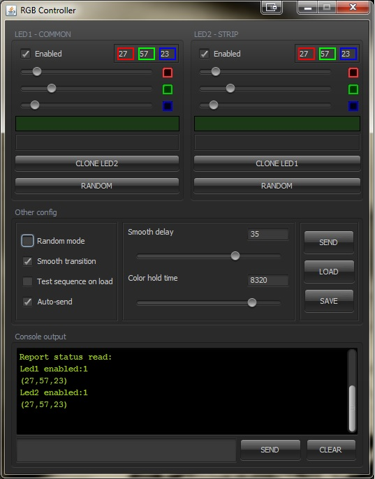

<html>
<head>
</head>
<body>

<h1>RGB Control</h1>

Projeto para controle de uma fita LED e um array de leds RGB de 4 pinos utilizando a comunicação entre uma placa Arduino nano e alguns componentes para controle de corrente.

Projeto baseado na comunicação serial via USB entre um microcontrolador baseado em Atmega168 e biblioteca RXTX.

Aplicação para controle das cores e funções do dispositivo:

Resultado final do circuito já instalado:

Repositório dos arquivos para criação do circuito para interface:

<a href="https://github.com/vinissaurus/RGB-Led-Casemod">Link</a>

</body>
</html>
