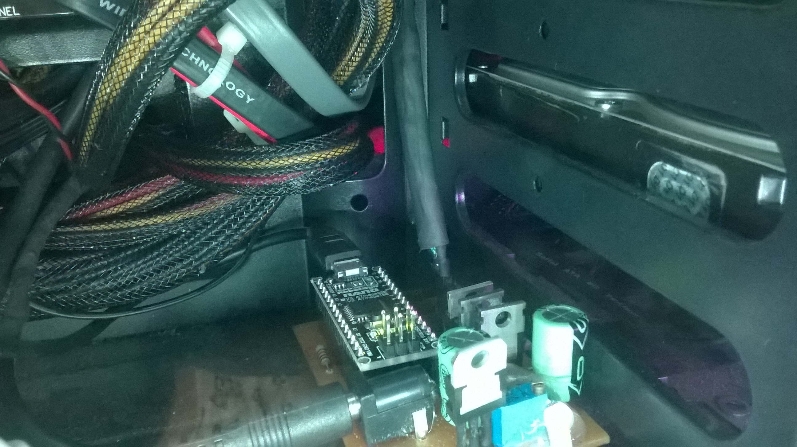

<html>
<head>
</head>
<body>

<h1>RGB Control</h1>

Projeto baseado na comunicação serial via USB entre um microcontrolador baseado em Atmega168 e biblioteca RXTX.

Resultado final do circuito já instalado:

Repositório dos arquivos para criação do circuito para interface:

<a href="https://github.com/vinissaurus/RGB-Led-Casemod">Link</a>

</body>
</html>
